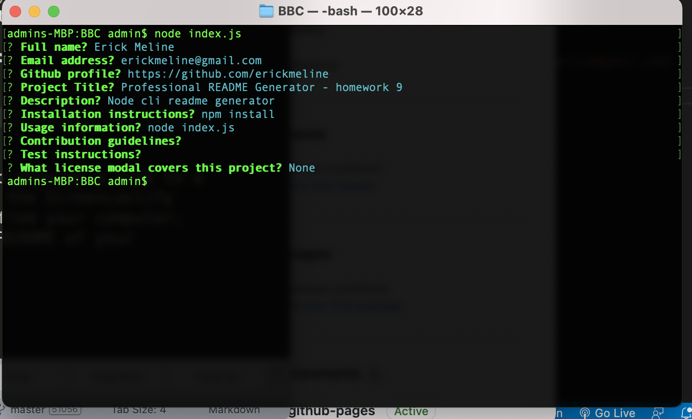

# Weather Dashboard (homework 6)

## Description

This project demonstrates the use of event listeners, local storage, multiple external api requests, and direct DOM manipulation.

## Demo
https://erickmeline.github.io/BBC/

## Uses
HTML/CSS/JS

## Librarys
MomentJs

## Screenshot

